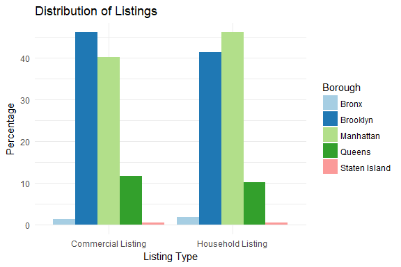
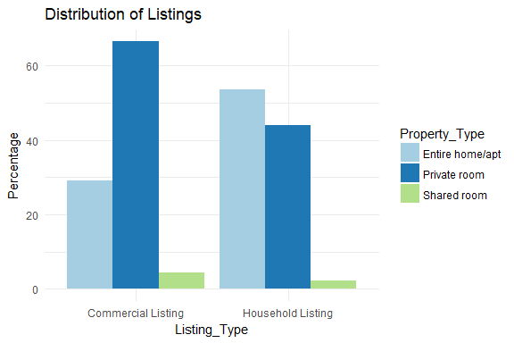
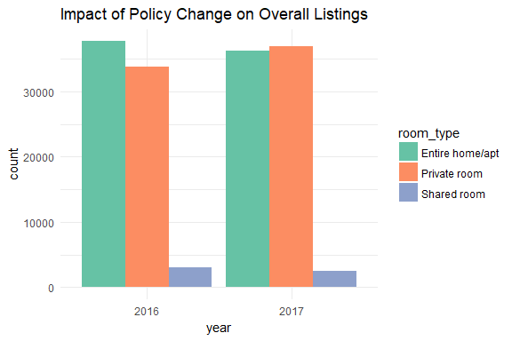
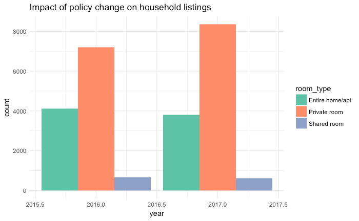
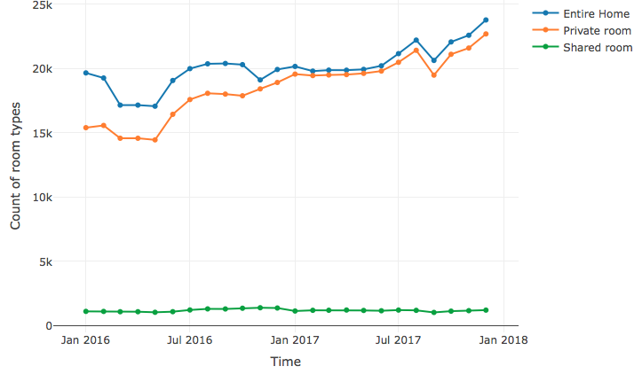
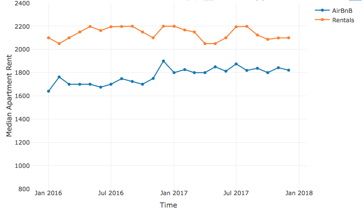
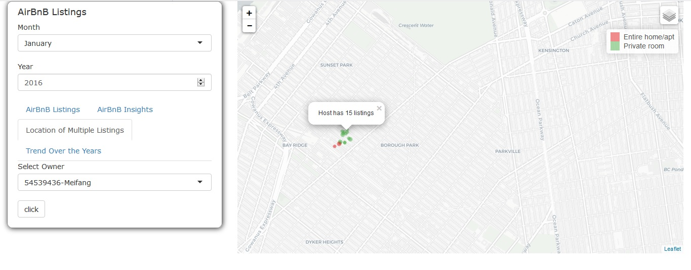

```{r setup, include=FALSE}
library(knitr)
opts_chunk$set(fig.path="images/",
               cache.path="cache/",
               cache=FALSE,
               echo=FALSE,
               message=FALSE,
               warning=FALSE) 
```

# Introduction  
  
## Identify commercial vs household airbnb listings.  
  


## Distribution of commercial and household listings across NY.  
  


## Distribution of commercial and household listings by room type.  
  



## Comparitive analysis between commercial and household listings wrt user scores.  
  


## Comparitive analysis between commercial and household listings wrt user reviews.  
  


## Comparitive analysis between commercial and household listings wrt price.  
  


## Rental Policy Change
  
Number of entire homes/apt decreased by 3.6% and private rooms increased on 9.2%. 
  



## Effects on commercial listings
  
Number of entire homes/apt decreased by 7.8% and private rooms increased on 16%.  
  


## Effects on non-commercial listings
  
Number of entire homes/apt decreased by 4% and private rooms increased on 7.7%.  
  


## Impact of Policy Change on distribution of room types  
  


## How have AirBnb's growth affected rental prices?  
  


## Pointout users having multiple listings  
  


