```{r setup, include=FALSE}
library(knitr)
opts_chunk$set(fig.path="images/",
               cache.path="cache/",
               cache=FALSE,
               echo=FALSE,
               message=FALSE,
               warning=FALSE) 
```

# Introduction  
While we need a place for a few days' stay during our travel to a different city, airbnb is primarily one of the options that comes to our mind. Due to the popularity many listings have mushroomed all over the city thoroughout different states. Many-a-times hosts operate their listing with the sole objective of maximizing their profit with disregard to local city laws. This phenomenon can have far reaching effects on the city at large.

With the above problem at hand, our project has tried to access the impact AirBnb has on rentals and tourism. We have approached the project mainly on four fronts:  
  
  - Segregate AirBnb listings into commercial and household rentals.
  - Comparitive analysis between commercial and household rentals.
  - Impact of AirBnb growth on rentals in NYC.
  - Proximity of AirBnb rentals to tourist places.  
  
## Dataset
Our sources of data are the below:
  - [Inside AirBnb](http://insideairbnb.com/get-the-data.html)
  - [Street Easy](https://streeteasy.com/blog/download-data/)
  - [Tourism Dataset](http://www.baltimoresun.com/travel/bs-tr-100-things-to-do-nyc-pictures-photogallery.html)
  


## Identify commercial vs household airbnb listings.  
In order to more familiarize ourselves, firstly we seggregated all airbnb listings in to commercial and household ones. The methodology was to obtain the unique listing_ids across a year. From the obtained list based on based on availability, score, review, count of multiple listings the listings were classified into commercial and household categories.

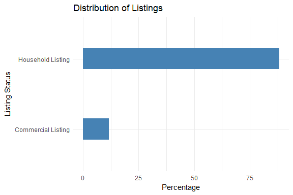
We saw that majority of the listings were household listings.

## Distribution of commercial and household listings across NY.  
Brooklyn had maximum commercial listings whereas Manhattan topped the count of household ones.
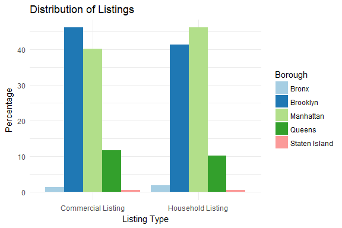

## Distribution of commercial and household listings by room type.  
Every listing was divided into either of the three categories 
 - Entire home/apartment
 - Private Room
 - Shared Room
Getting an overview of this distribution was a critical step in the subsequent analysis of rental policy change.

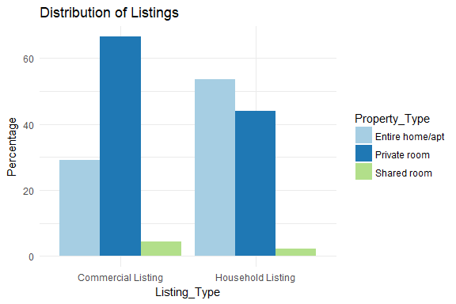
  
  
Most commercial listings were private rooms whereas household listings were entire home/apt. This gave an idea as to how the property types were distributed.


## Comparitive analysis between commercial and household listings wrt user scores.  
For ascertaining the parameter user scores, the parameters cleanliness, location, checkin accuracy, host availability, host contact were averaged to get a score from 1-> 100. These features were averaged across all listings for a particular neighbourhood. This can signify quality of listings across a neighbourhood. 

To get a neighbouhood by neighbourhood comparison, these visualisations were made interactively available on shiny.

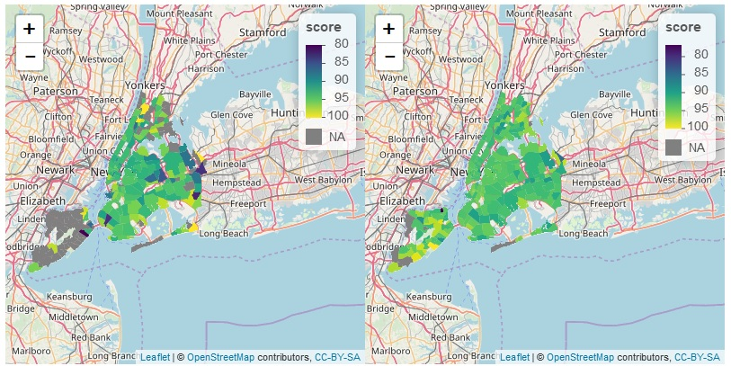

## Comparitive analysis between commercial and household listings wrt user reviews.  
User review scores were averaged across all listings for a particular neighbourhood. This can signify user acceptance rate of listings across a neighbourhood. 

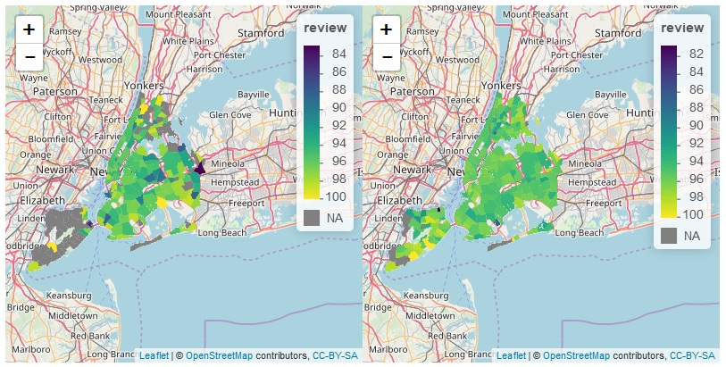

## Comparitive analysis between commercial and household listings wrt price.  
  Listing price was averaged across all listings for a particular neighbourhood.

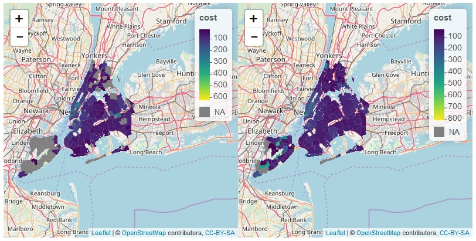

## Rental Policy Change
  On October 21 2016, New York State Governor Cuomo signed into law a new bill, the "Anti-Airbnb Advertising Law", which effectively makes it illegal to rent out most apartments in NYC on short-term-rental platforms like Airbnb, if the "host" is not present, and the stay would be for less than 30 days.
  To gauge the impact of this law and access ground reality, we decided compare listings before and after the law was enacted. 
  We observed that number of entire homes/apt decreased by 3.6% and private rooms increased on 9.2% from 2016 to 2017. 
  
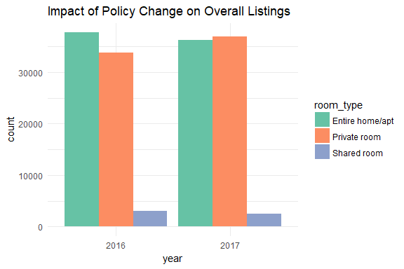


## Effects on commercial listings
  
Number of entire homes/apt decreased by 7.8% and private rooms increased on 16%.  
  
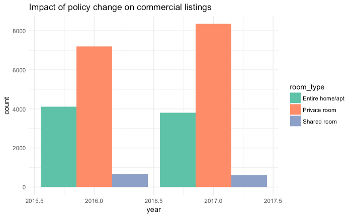

## Effects on non-commercial listings
  
Number of entire homes/apt decreased by 4% and private rooms increased on 7.7%.  
  


## Impact of Policy Change on distribution of room types  
  - From the above plots it appears that, hosts have converted their single apartments to multiple private rooms to bypass the regulation.
  - Due to laxity in enforcing the rules by AirBnb there is only a reduction of 3.66% in the number of the number of entire homes.
  
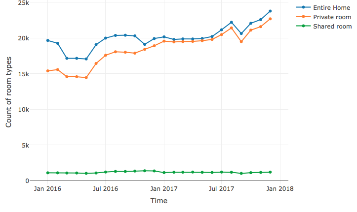
    
  - There is a dip fom october 2016 to jan 2017 probably due to the policy change.
  - Prior to the policy change there is a signifanct difference between teh number of private rooms and entire homes. Currently the count of private rooms are catching up with the entire home/apt, showing the probable conversion of entire homes to multiple private rooms.
  

## Pointout users having multiple listings  
Shiny app to identify potential violators.
[Shiny App](https://itslimelight.shinyapps.io/impact--airbnb/)
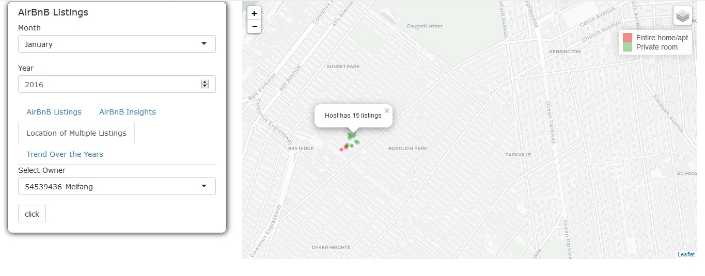

  
## Tourist places having maximum number of nearest Airbnb listings  
Airbnb serves as an affordable housing resource for tourists, so we decided to analyze the proximity of Airbnbs to tourist places in NYC. For this we Combined two data sets, one of the Airbnb and another of tourist places. Continuing with the theme of exploring commercial and noncommercial Airbnbs, we segregated them to see, if any of the other might be more strategically located to the tourist locations.

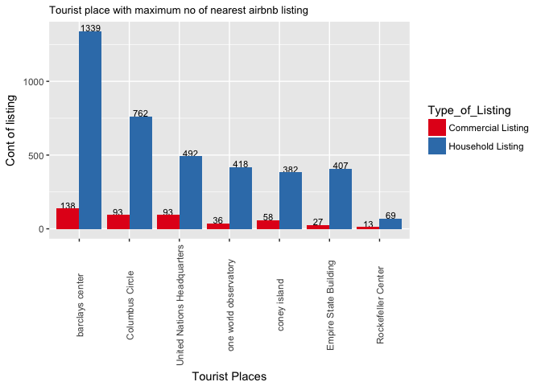
  
The plot above visualizes tourist places having maximum number of nearest Airbnb listings
From the plot we  see that noncommercial listings are way ahead when it comes to being strategically located around tourist places.

## Average listing prices for the nearest Airbnbs across some of the top tourist places

We decided to analyze the average listing prices for the nearest Airbnbs across some tourist places to see the price variations depending on the upscale location of the tourist places.
For example Rockefeller center and one world observatory are amongst the costliest tourist places to rent Airbnbs in.

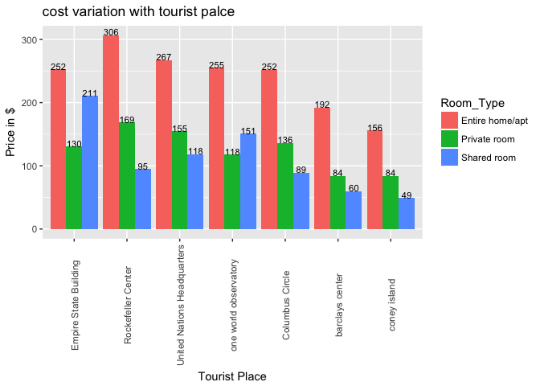
  
The Airbnb listings have been segregated into entire apartment/private/shared and as expected renting a private space turns out to be much more expensive than a shared space.


## Average listing prices for the nearest commercial Airbnbs

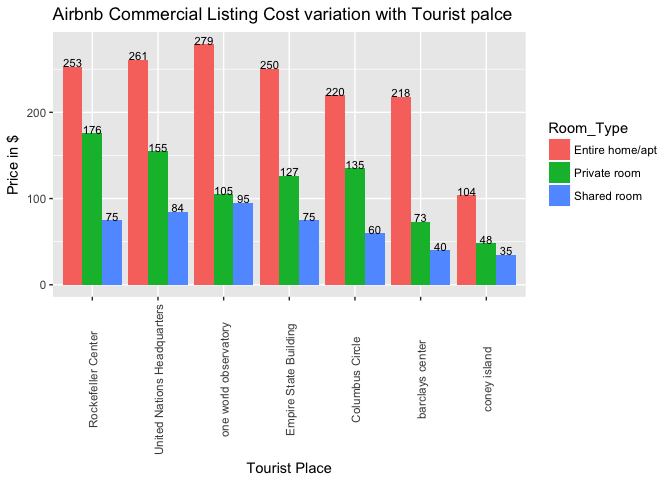

## Average listing prices for the nearest non commercial Airbnbs

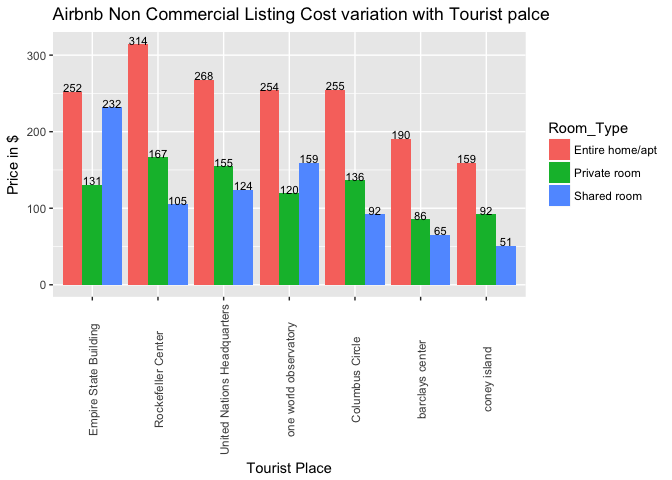
## Relative proximity of Airbnb listings to tourist places
In this plot we tried to explore the relative proximity of commercial and noncommercial Airbnb listings to tourist places.

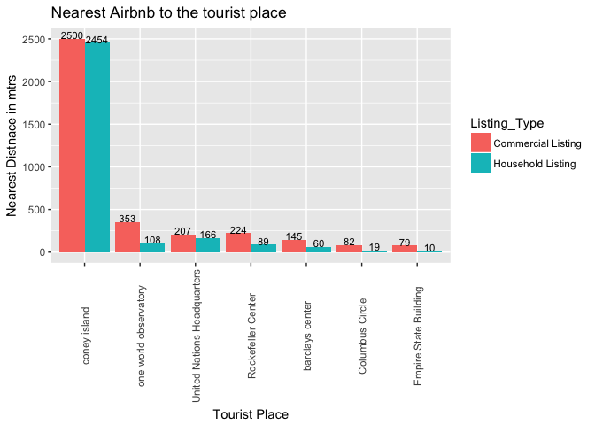
  
From the plot we can see a consistent pattern that noncommercial listings are closer when compared to commercial listings.

## How have AirBnb's growth affected rental prices?  
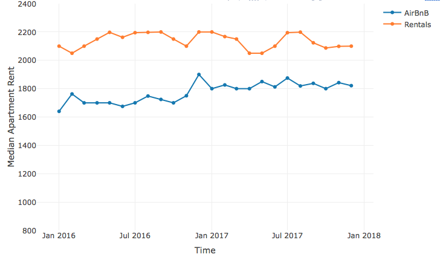

## Time series analysis of rental and Airbnb rent prices

We analyzed Airbnb listings and apartment rental listings , to specifically study the trend in their respective listing prices over time and if at all they had an effect on one another.

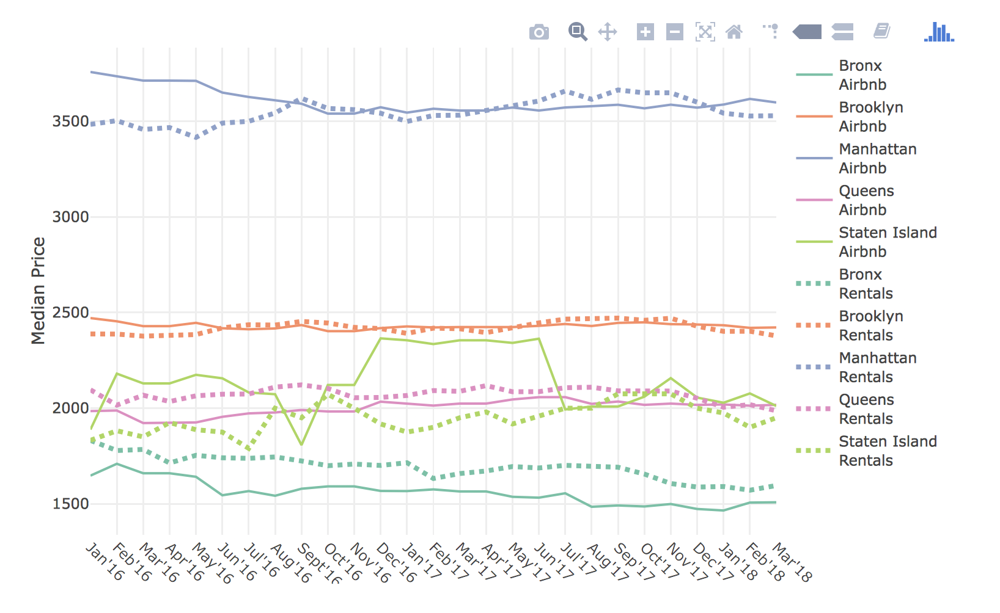
  
We see that the boro of Manhattan has both very high rental and Airbnb list prices
In all the boros we see that the prices for Airbnbs are cheaper when compared to rental listings, which explains the popularity of Airbnbs.

## Time series analysis of rental and Airbnb Occupancy rate

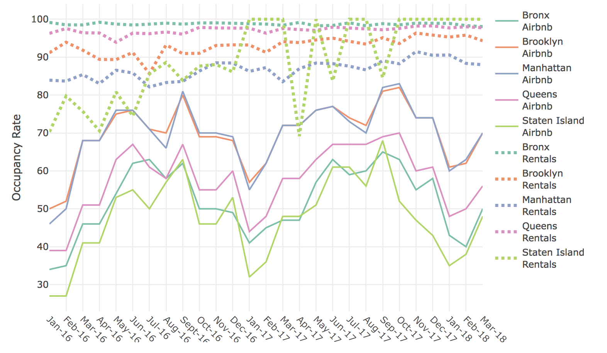
  
Despite Airbnb being cheaper, occupancy rates of rental listing is higher than the Airbnb listing.


## Challenges  
  - We tried to perform text analysis between reviews of commercial vs household listings. We aimed to find if commercial listings are significantly better than household ones, but since the data was too huge for computation purposes. Reveiws.rmd shows the same attempt for a single month of data, but takes a long time to execute.
  - We also wanted to compare the amenities between two kinds of listings, and neighbourhood price difference between airbnb and rentals but due to time constraints we could not execute the same.
  - We wanted to analyse the effect of AirBnb on hotel business but could not find corresponding data in time.


## References
  - http://insideairbnb.com/nyc-report-on-the-anti-airbnb-advertising-law/
  - http://insideairbnb.com/how-airbnb-hid-the-facts-in-nyc/


